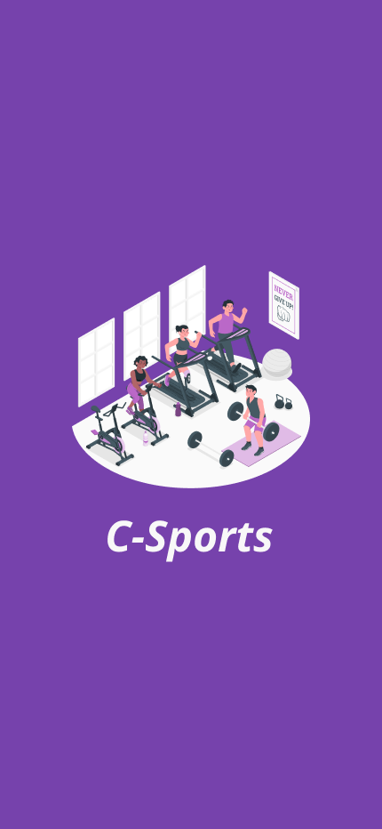

# APLIKASI CSPORT

---
Download APP (APK) <a href="https://expo.dev/artifacts/eas/t3tCYKMjwkczRJCJHvsHez.apk">HERE</a>.

#### Screnshoot
<p align="center">
    
</p>

## Deskripsi
Aplikasi CSport merupakan aplikasi "olahraga" yang dapat membantu kamu dalam melakukan kegiatan jasmani. Dengan aplikasi ini pastinya akan membuat kegiatan olahragamu berjalan secara maksimal dan penuh semangat.

## Fitur utama :
- Sign In dan Sign Up
- Target Powerlifting
- Menghitung Jarak Jogging
- Leaderboard

## Struktur Repo
```
/
├─ assets/                  # All assets and screen
└─ components/
│      └─ EditProfile.js    # Edit bio
│      └─ Leaderboard.js    # For competitive feature
│      └─ Powerlifting.js   # Gym activity saving feature
|      └─ ProfileScreen.js  # Personal information
|      └─ Record.js         # Record Gym activity
|      └─ Running.js        # Run Feature
|      └─ Splash.js         # Handling splash screen
|      └─ StartRunning.js   # Record distance and time
|      └─ Workout.js        # Gym activity
├─ src/
├─ └─ redux-thunk/
│      └─ Actions.js        # Action File Fetch Redux Thunk
│      └─ Actions.test.js   # Jest Testing Unit Action Fetch Redux Thunk
│      └─ Reducer.js        # Reducer for state based on Action
│      └─ store.js          # Middleware File Redux Thunk
│  └─ SignIn.js             # Login page (Landing page)
│  └─ SignUp.js             # Register Page
│
├─ App.js                   # Rendering App
├─ .gitignore
├─ README.md
├─ app.json
├─ babel.config.json
├─ config.js                # Setting IP (base Url)
├─ eas.json
├─ jest.config.json
├─ package.json
├─ yarn.lock
```
## Requirements
- [NPM](https://nodejs.org/en)
- [React native](https://reactnative.dev/)
- [React native vector icon by MaterialComunityIcons](https://materialdesignicons.com/)
- [Expo](https://expo.dev/)
- Redux Thunk
- Jest
- Redux Mock Store

## Cara Install
buka terminal di folder adda file ini, run command:
`npm install`

atau

`yarn`

setelah itu

`npm start`

atau 

`yarn start`


## Collaborator
|  [<br /><sub><b>Geizka Rozilia Ruicosta</b><br/>(119140114)</sub>](https://github.com/Shercosta)<br />[💻](https://github.com/Shercosta/csport/commits?author=Shercosta "Code") | [<br /><sub><b>Bilhaq Avi Dewantara</b><br/>(120140141)</sub>](https://github.com/BilhaqAD07)<br />[💻](https://github.com/Shercosta/csport/commits?author=BilhaqAD07 "Code") |  [<br /><sub><b>Gery Melia Suwanda</b><br/>(120140147)</sub>](https://github.com/GeryMs19)<br />[💻](https://github.com/Shercosta/csport/commits?author=GeryMs19 "Code") | [<br /><sub><b>Fadhilah Fauza Hamda</b><br/>(120140153)</sub>](https://github.com/fadhilahfauza)<br />[💻](https://github.com/Shercosta/csport/commits?author=fadhilahfauza "Code") |
|--|--|--|--|

<br>


